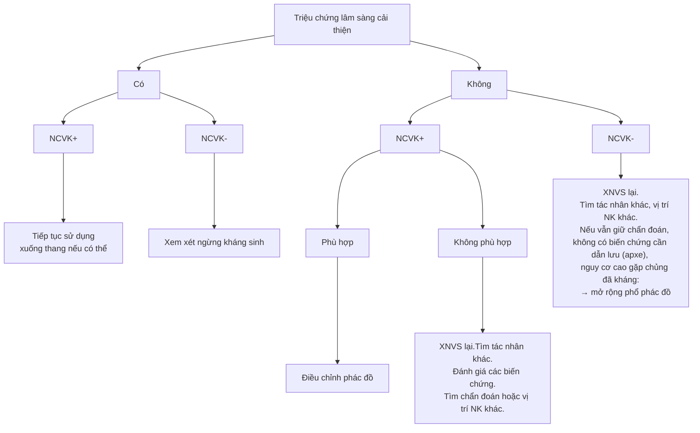

---
{"dg-publish":true,"permalink":"/data-storage/dieu-tri/dieu-tri-viem-phoi/","noteIcon":"1","created":"2024-10-17T10:26:53.163+07:00","updated":"2025-12-28T15:23:47.323+07:00"}
---

📚 Tài liệu tham khảo 
- Giáo trình điều trị nội PNTU 2023
- Slide viêm phổi (BS Tùng Lâm) 2024
- Phác đồ VPCĐ BYT 2020

> [!tip] Tổng quan
> - Kháng sinh là phương pháp điều trị chính viêm phổi do vi khuẩn. 
> - Việc sử dụng kháng sinh ban đầu cần dựa trên đánh giá lâm sàng, kết hợp XQ, không chờ có kết quả cận lâm sàng mới bắt đầu điều trị. 
# Lựa chọn kháng sinh
## Yếu tố ảnh hưởng
- Loại viêm phổi - mức độ nặng - nguy cơ tử vong
- Bệnh đồng mắc
- Sử dụng kháng sinh 3 tháng trước đó (nguy cơ nhiễm vi khuẩn kháng thuốc)
- Tiền căn nhiễm MRSA, Pseudomonas
- Sống ở vùng có tỉ lệ phế cầu kháng macrolide cao
- Tác nhân gây bệnh
	- H. influenza tiết men β-lactamase
	- Streptococcus pneumonia biến đổi cấu trúc đích của penicillin binding protein
## Lựa chọn kháng sinh
- CAP nặng: suy hô hấp cần thở máy hoặc sốc được điều trị bằng thuốc vận mạch → xem xét  điều trị kháng sinh bao phủ MRSA và pseudomonas trong khi chờ đánh giá nguy cơ và kết quả xét nghiệm. 
- Lựa chọn kháng sinh bao phủ Pseudomonas nếu có yếu tố nguy cơ
	- Tiền sử nhiễm pseudomonas và trực khuẩn gram âm khi nhuộm Gram  
	-  Điều trị kháng sinh TM trong vòng 3 tháng  
	- Giãn phế quản và các đợt cấp COPD cần điều trị bằng glucocorticoid hoặc kháng sinh.
- Lựa chọn kháng sinh bao phủ MRSA nếu có yếu tố nguy cơ
	- Tiền sử nhiễm MRSA và cầu khuẩn gram dương.
	- Điều trị kháng sinh TM trong vòng 3 tháng 
	- Bệnh giống cúm gần đây, thâm nhiễm tạo hang hoặc viêm mủ màng phổi và bệnh thận giai đoạn cuối ESKD
# Điều trị kháng sinh
## Phổ kháng sinh

## PK/PD của kháng sinh 
- Điểm pK/pD phải cao hơn MIC thì điều trị mới hiệu quả
- 3 nhóm kháng sinh theo pK/pD

| Nhóm kháng sinh                           | Thông số PK/PD đặc trưng                                                                                                | Nhóm kháng sinh hoặc thuốc cụ thể    | Chiến lược tối ưu hóa sử dụng                                                                                                                               |
| ----------------------------------------- | ----------------------------------------------------------------------------------------------------------------------- | ------------------------------------ | ----------------------------------------------------------------------------------------------------------------------------------------------------------- |
| Phụ thuộc thời gian                       | Tỷ lệ % giữa thời gian kháng sinh có nồng độ trong máu vượt quá giá trị MIC so với khoảng thời gian đưa liều (%T > MIC) | β-lactam, Linezolid                  | Tăng liều Tăng tần suất đưa thuốc trong ngày  Cân nhắc truyền kéo dài hoặc truyền liên tục trong trường hợp nhiễm khuẩn nặng hoặc trên bệnh nhân nặng |
| Phụ thuộc nồng độ                         | Tỷ lệ giữa nồng độ tối đa của thuốc trong máu so với giá trị MIC (Cmax/MIC).                                            | Aminoglycosid                        | Sử dụng liều tối đa + giãn cách khoảng đưa liều                                                                                                             |
| Phụ thuộc vào tổng lượng thuốc vào cơ thể | Tỷ lệ giữa tổng lượng thuốc trong cơ thể so với giá trị MIC (AUC/MIC)                                                   | Fluoroquinolon, Macrolid, Vancomycin | Tăng tổng liều trong 24 giờ                                                                                                                                 |
## Nguyên tắc
- Lấy bệnh phẩm (nhuộm Gram và cấy đàm, cấy máu) trước khi điều trị KS ở BN nhập viện.  
- Dùng kháng sinh càng sớm càng tốt trong **4 giờ đầu** nhập viện **theo kinh nghiệm**, khi có KQ nuôi cấy và kháng sinh đồ thì điều chỉnh theo KS đồ và đáp ứng lâm sàng của BN  
- Nên điều trị với kháng sinh thuộc nhóm khác nếu đã điều trị trước đó với kháng sinh
- BN nhập viện nên bắt đầu với KS đường truyền **tĩnh mạch, đủ liều**. Sau vài ngày có thể chuyển sang uống nếu có đáp ứng lâm sàng
- Dùng KS theo dược động học và dược lực học, chỉnh liều theo eGFR 
- Chọn KS diệt khuẩn, đặc biệt đối BN có bệnh lý đồng mắc nặng và/hoặc suy giảm miễn dịch  
-  Đánh giá điều trị sau 48-72 giờ, nếu không cải thiện → thay đổi phác đồ
- Chuyển sang đường uống khi BN cải thiện ho, khó thở, hết sốt 48-72 giờ và BN uống được
- Thời gian điều trị tùy theo lâm sàng và X-quang, tối thiểu 5 ngày, thường 3-5 ngày sau khi hết sốt đối với S.pneumoniae. 7 – 10 ngày đối với CAP không biến chứng. Legionella, Chlamydia thời gian tối  thiểu 2-3 tuần. BN sử dụng thuốc ức chế miễn dịch và điều trị lâu dài corticoid: > 14 ngày   
- Xuất viện: khi ổn định lâm sàng và chuyển sang kháng sinh uống cho đủ liệu trình.
# Lựa chọn phương pháp điều trị

# Điều trị CAP theo kinh nghiệm
Theo ATS/IDSA 2019

|                     | Ngoại trú                                                                                                                                                                                                                                                                                                                                                                                                | Nội trú                                                                                                               | ICU                                                                                                                                                                                                                                                                                                                          |
| ------------------- | -------------------------------------------------------------------------------------------------------------------------------------------------------------------------------------------------------------------------------------------------------------------------------------------------------------------------------------------------------------------------------------------------------- | --------------------------------------------------------------------------------------------------------------------- | ---------------------------------------------------------------------------------------------------------------------------------------------------------------------------------------------------------------------------------------------------------------------------------------------------------------------------- |
| Phác đồ tiêu chuẩn  | < 65 tuổi, không bệnh đồng mắc, không sử dụng kháng sinh 3 tháng Amoxicillin/Ampicillin/Macrolide > 65 tuổi, có bệnh đồng mắc, sử dụng kháng sinh trong 3 tháng, sống ở vùng kháng macrolide Amoxicillin/clavulanat hoặc Cephalosporine + Macrolide/ Doxycycline Hoặc Quinolone hô hấp đơn trị  | β-lactam ± ức chế β lactamase + macrolide/ Quinolone hô hấp | β-lactam ± ức chế β lactamase + macrolide/quinolone                                                                                                                                                                                                                                             |
| Các trường hợp khác | Nếu có H.influenzae amoxicillin/acid clavulanate                                                                                                                                                                                                                                                                                                                         |                                                                                                                       | Nếu có nguy cơ nhiễm Pseudomonas   β-lactam chống Pseudomonas + Quinolone hô hấp hoặc β-lactam chống Pseudomonas + Aminoglycoside + Macrolide  Nếu có nguy cơ nhiễm MRSA Thêm Linezolid, Vancomycin, Teicoplanin |

## Ngoại trú
- Bệnh nhân < 65 tuổi, không bệnh đồng mắc, không dùng kháng sinh trong 3 tháng trước
	- Ampicillin hoặc amoxicillin hướng đến S.pneumoniae
	- Macrolide (azithromycin, clarithromycin) khi chưa loại trừ M.pneumoniae hoặc nghi ngờ vi khuẩn không điển hình
- Bệnh nhân > 65 tuổi, có bệnh đồng mắc, sgmd, dùng kháng sinh 3 tháng trước, hoặc ở vùng S.pneumoniae kháng macrolide cao
	- Chọn Amoxicillin/clavulanate hoặc cephalosporin phổ rộng (cefpodozim, cefdinir, cefditoren) và macrolide thế hệ mới/ doxycycline, khuyến cáo sử dụng:
		-  Ampicillin/sulbactam 
		- Cefotaxime, ceftriaxone, ceftazoline
		- Azithromycin, clarithromycin
	- Hoặc quinolone hô hấp đơn trị liệu (khuyến cáo levofloxacin, moxifloxacin)
- Dị ứng β-lactam hay macrolid → Quinolone hô hấp (levofloxacin, moxifloxacin)
- Tổng trạng suy kiệt, X quang ngực có những tổn thương nặng (thâm nhiễm > 1 thuỳ, tổn thương hoại tử, tổn thương tiến triển trong 48-72 giờ → nên điều trị nội trú với kháng sinh đường tĩnh mạch, mặc dù thang điểm PSI hay CURB-65 chưa đủ tiêu chuẩn nhập viện
- Nếu nhiều khả năng H.influenzae nên dùng β-lactam + ức chế β lactamase đường uống (amoxicillin/acid clavulanate) hoặc ceftriaxone
- Làm thêm xét nghiệm nhanh như multiplex PCR để phát hiện vi khuẩn, nấm, virus nhằm hướng dẫn điều trị kháng sinh.
- Cần làm PCT 3 thời điểm: khi nhập viện, sau 48-72h và sau 5-7 ngày) giúp, bệnh nhân có bệnh nền, tiền sử sử dụng kháng sinh gần đầy, vì cần dự trữ nhóm thuốc này, tránh kháng thuốc
## Nội trú
- *Nếu giảm oxy máu nên cho thở HFNO/NIV thay vì thở oxy* 
- *Nếu test nhanh virus (+) dùng thêm Oseltamivir*
- VAP trung bình:
	- β lactam ± ức chế β lactamase/cephalosporin + macrolide tĩnh mạch, hoặc
	- quinolone hô hấp tĩnh mạch sau khi đã loại trừ lao *(hình như đơn trị, phác đồ BYT ghi không rõ)*
- Nên lưu ý tác nhân vi khuẩn gram âm đường ruột (P.aeruginosae nếu có yếu tố nguy cơ nhiễm tác nhân này) và điều trị nên bao phủ luôn tác nhân không điển hình. Nên dùng KS đường tiêm betalactam/ức chế betalactamase piperacillin/tazobactam), ceftazidim, cefepime kết hợp macrolide hay quinolone
- Nếu có tiền căn nhiễm MRSA hoặc Pseu → kháng sinh bao phủ MRSA/Pseu kèm với cấy đàm/phết mũi để xác định chẩn đoán và quyết định nên xuống thang hay tiếp tục điều trị
- Nếu có yếu tố nguy cơ nhiễm MRSA/Pseu 
	- Viêm phổi trung bình → cấy đàm nhưng chỉ dùng kháng sinh bao phủ MRSA/Pseu khi kết quả (+)
	- Viêm phổi nặng → kháng sinh bao phủ MRSA/Pseu kèm với cấy đàm/phết mũi 
## ICU
- Dùng corticosteroids khi có sốc 
- Betalactam phổ rộng ±  ức chế betalactamase + quinolone/ macrolide TTM.
- Nếu có nguy cơ nhiễm Pseudomonas
	- β-lactam chống Pseudomonas + Ciprofloxacin/Levofloxacin
		- Piperacilin/tazobactam
		- Imipenem, Meropenem, Doripenem
		- Aztreonam nếu dị ứng penicillin
		- Ceftazidim, Cefepime
	- β-lactam chống Pseudomonas + aminoglycoside + azithromycin/clarithromycin
- Nếu có nguy cơ nhiễm MRSA: thêm vancomycin, linezolid, teicoplanin 
# Đánh giá lại sau phác đồ kinh nghiệm

*NCVK: nuôi cấy vi khuẩn*
# Điều trị theo tác nhân khi có kết quả vi sinh
- Vi khuẩn có kết quả KS đồ → Dựa vào kháng sinh đồ  
- Nếu bệnh nhân có đáp ứng điều trị tốt thì không cần thay đổi kháng sinh đang sử dụng mặc dù kháng sinh đồ cho kết quả kháng sinh đang dùng bị đề kháng  
- Dựa vào kháng sinh đồ có thể xuống thang kháng sinh nếu được.
- Vi khuẩn ESBL (+): Imipenem, Meropenem, Ertapenem
- H.influenzae: amoxicillin/acid clavulanate, ceftriaxone
- Pseudomonas aeruginosa
	- Piperacillin/tazobactam
	- Imipenem, Meropenem
	- Ceftazidime, Cefepim
	- Levofloxacin, Moxifloxacin
- MRSA: Vancomycin, linezolid, teicoplanin
- Melioidosis
	- Giai đoạn tấn công: 2 tuần, nếu viêm nhiều thùy phổi thì kháng sinh tĩnh mạch kéo dài 3 tuần (ceftazidim hoặc meropenem TTM)
	- Giai đoạn duy trì: 3 tháng (TMP-SMX hoặc doxycycline uống)
- Virus cúm
	- Kháng virus nên được sử dụng cho những bệnh nhân có nguy cơ cao, bệnh cảnh nghiêm trọng, và cho tất cả bệnh nhân nằm viện vì cúm.  
	- BN ngoại trú: liệu pháp kháng virus có hiệu quả khi được sử dụng trong vòng 48h sau khi xuất hiện triệu chứng
# Theo dõi sau điều trị
## Viêm phổi không đáp ứng điều trị
- Sốt và bạch cầu thường cải thiện sau 48-96h → Nếu sau 72h bệnh nhân không cải thiện cần đánh giá lại toàn diện, có thể là do
	- Có biến chứng
	- Chẩn đoán khác
	- Tác nhân khác
	- Cơ địa bệnh nhân

## Thất bại điều trị
- Thất bại điều trị trong VPCĐ 10-15% → tăng tỉ lệ tử vong lên gấp 5 lần
- Thất bại điều trị sớm  
	- Lâm sàng xấu đi trong vòng 72 giờ đầu sau điều trị kháng sinh do huyết động không ổn định  
	- Xuất hiện mới hoặc gia tăng suy hô hấp cần thở máy, tổn thương phổi tiến triển hoặc xuất hiện các tổn thương mới trên X-quang
- Thất bại điều trị muộn  
	- Sốt dai dẳng hoặc tái phát các triệu chứng hoặc huyết động không ổn định  
	- Sự phát triển hoặc suy hô hấp 
	- Tổn thương phổi tiến triển hoặc xuất hiện các tổn thương mới trên Xquang sau 72 giờ điều trị KS
## Chuyển kháng sinh tĩnh mạch sang đường uống
Chỉ định khi
- Nhiệt độ ≤ 37,8 ⁰C 
- Nhịp tim ≤ 100 lần/phút
- Nhịp thở ≤ 24 lần/phút
- Huyết áp tâm thu ≥ 90 mmHg
- SaO2 ≥ 90% hoặc PO2 ≥ 60 mmHg 
- Có khả năng ăn uống
- Sức khỏe tâm thần bình thường

| Nhóm   | Định nghĩa                                                                                                       | Kháng sinh ví dụ                                     |
| ------ | ---------------------------------------------------------------------------------------------------------------- | ---------------------------------------------------- |
| Nhóm 1 | Kháng sinh có sinh khả dụng đường uống cao (> 90%), hấp thu tốt và dung nạp tốt ở liều tương tự liều đường tiêm. | Co-trimoxazol, Levofloxacin, Linezolid, Moxifloxacin |
| Nhóm 2 | Kháng sinh có sinh khả dụng đường uống thấp hơn nhưng có thể bù trừ bằng tăng liều                               | Ciprofloxacin                                        |
| Nhóm 3 | Kháng sinh có sinh khả dụng đường uống cao (> 90%) nhưng dung nạp tiêu hóa kém                                   | Amoxicillin, Cephalexin, Clindamycin                 |
| Nhóm 4 | Kháng sinh có sinh khả dụng đường uống thấp hơn                                                                  | Cefuroxim                                            |
## Thời gian điều trị
- CAP đáp ứng lâm sàng tốt 2 - 3 ngày điều trị, thời gian điều trị KS từ 5 - 7 ngày
- S. aureus: 7-21 ngày tùy mức độ nặng. Nhiễm khuẩn huyết có thể > 4 tuần. KS 14 ngày nếu đáp ứng các tiêu chí
	- Cấy máu sau 2-4 ngày âm tính và bệnh nhân hết sốt trong 72 giờ;  
	- Không có viêm nội tâm mạc (siêu âm tim qua thực quản)  
	- Không có các thiết bị cấy ghép trên cơ thể;  
	- Không có ổ nhiễm trùng do bệnh khác. 
	- Không nên dừng kháng sinh sớm ở bệnh có nhiều bệnh lý đồng mắc
- Pseudomonas aeruginosa  
	- BN không có bệnh đi kèm đáng kể, giảm sốt và cải thiện lâm sàng trong tuần đầu và không kháng thuốc: 7 - 10 ngày.  
	- 10 - 21 ngày BN có các tình trạng tiềm ẩn nghiêm trọng, nhiễm trùng máu đồng thời, đáp ứng kém hoặc chậm với điều trị, và/hoặc nhạy cảm một phần hoặc đa kháng thuốc.  
- Burkholderia pseudomallei: KS sau xuất viện từ 3-6 tháng tùy thuộc việc có viêm tủy xương, biến chứng thần kinh hay không (TMP-SMX hoặc doxycycline)
# Phòng bệnh CAP
## Nguyên tắc
1. Điều trị triệt để các ổ nhiễm khuẩn vùng tai mũi họng, răng miệng  
2. Điều trị tốt bệnh nền: Đái tháo đường, COPD, bệnh gan thận mạn tính  
3. Loại bỏ những kích thích có hại: thuốc lá, thuốc lào, bia rượu  
4. Giữ ấm cổ ngực trong mùa lạnh  
5. Tiêm chủng vacxin chống virus, vi khuẩn
## Tiêm phòng cúm
- Tuổi trên > 65 tuổi  
- Sống tại nhà dưỡng lão  
- Mắc bệnh tim phổi mạn tính, bệnh chuyển hóa mạn tính.  
- Suy giảm miễn dịch.  
- Bệnh nhân từ 6 tháng đến 18 tuổi dùng aspirin kéo dài  
- Nhân viên y tế, chủ yếu để tránh lây cúm cho các bệnh  nhân có nguy cơ cao  
- Người thường xuyên tiếp xúc với người có nguy cơ cao  
- Béo phì BMI ≥40kg/m
## Tiêm phòng phế cầu
- Khi tiêm lần đầu < 65 tuổi, tiêm nhắc lại sau 5 năm  
- Lần đầu tiêm sau tuổi 65 không cần tiêm nhắc lại  
- Chỉ định  
	- Bệnh tim phổi mạn tính  
	-  Đái tháo đường  
	-  Nghiện rượu  
	-  Bệnh gan mạn tính  
	- Dò dịch não tủy  
	- Bệnh hồng cầu hình liềm  
	- Cắt lách  
	- Tình trạng suy giảm miễn dịch: nhiễm HIV, suy thận mạn, dùng thuốc ức chế miễn dịch…
## Dự phòng khác
- Tiêm phòng COVID-19 cho cán bộ y tế, người trên 50 tuổi, người có bệnh nền, người trên 18 tuổi nhưng chưa tiêm mũi nào, phụ nữ có thai  
- Tiêm phòng RSV cho người > 60 tuổi, có bệnh phổi mạn tính, suy giảm miễn dịch.  
- Tư vấn cai thuốc lá.