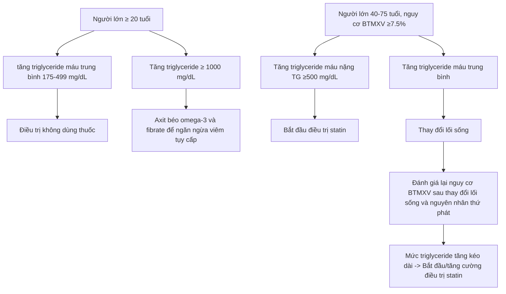

---
{"dg-publish":true,"permalink":"/data-storage/dot-2/dieu-tri-noi/dieu-tri-roi-loan-lipid-mau/","noteIcon":"1","created":"2024-10-05T10:49:39.329+07:00","updated":"2025-12-28T15:28:41.137+07:00"}
---

- Là yếu tố nguy cơ chính và thường gặp của bệnh tim mạch do xơ vữa (BTMXV): bệnh mạch vành, đột quỵ, bệnh mạch máu ngoại biên
- Giảm mức LDL-cholesterol 1% ↓ # 1% nguy cơ các biến cố và tử vong của BTMXV

> [!error]- Keypoints
> - Đánh giá yếu tố nguy cơ
> - Dự phòng nguyên phát hoặc thứ phát
> - Thay đổi lối sống
> - Liệu pháp dùng thuốc
# 1 Tiêu chuẩn chẩn đoán 
Chẩn đoán rối loạn lipid máu khi có 1 hoặc nhiều bất thường sau đây
- Cholesterol máu > 200 mg/dL (5.2 mmol/L)
- Triglyceride > 150 mg/dL (1.7 mmol/L)
- HDL-c < 40 mg/L (1.03 mmol/L)
- LDL-c > 100 mg/dL (2.58 mmol/L)
# 2 Đối tượng
4 nhóm có lợi khi điều trị với statin ==(nhớ, là tóm tắt của guideline dự phòng nguyên phát và thứ phát below, nếu không thuộc nhóm này có nghĩ là điều trị không dùng thuốc)==
- Bệnh tim mạch do xơ vữa lâm sàng (động mạch vành, não, ngoại biên) → phòng ngừa thứ phát
- Tăng LDL-c nguyên phát ≥ 190 mg/dL
- Đái tháo đường 40-75 tuổi và LDL-c 70-189 mg/dL
- Tuổi 40-75 tuổi có LDL-c 70-189 mg/dL và ước tính nguy cơ 10 năm BTMXV ≥ 7.5%
# 3 Dự phòng nguyên phát
## 3.1 Chiến lược

- Bệnh nhân 20-75 tuổi có LDL-c ≥ 190 mg/dL → statin cường độ cao không ước tính nguy cơ 
- Bệnh nhân ĐTĐ + 40-75 tuổi + (thường sẽ có LDL-c ≥ 70)→ statin cường độ trung bình (không cần ước tính nguy cơ 10 năm) kết hợp xem xét statin cường độ cao nếu có các yếu tố nguy cơ:  
	- ≥10 năm đối với ĐTĐ type 2 và ≥20 năm đối với ĐTĐ type 1  
	- ≥30 mcg albumin/mg creatinine  
	- eGFR <60 ml/phút/1,73 m2  
	- Bệnh lý võng mạc  
	- Bệnh lý thần kinh  
	- ABI <0,9.  
- Người < 20 tuổi →  thực hành lối sống lành mạnh. Chỉ nên điều trị statin với người 10 - 19 tuổi có LDC-c ≥ 190 mg/dL hoặc ≥ 160 mg/dL kéo dài, kèm biểu hiện lâm sàng phù hợp ↑ cholesterol máu gia đình, không đáp ứng với biện pháp thay đổi lối sống từ 3-6 tháng 
- Người 20-39 tuổi, tính nguy cơ suốt đời BTMXV và thay đổi lối sống.  Xem xét statin ở người có tiền căn gia đình mắc BTMXV sớm và LDL-c ≥ 160 mg/dL
- Tuổi 40-75 tuổi và LDL-c  từ 70-189 mg/dL, không ĐTĐ: sử dụng công cụ ước tính nguy cơ 
	- Nguy cơ từ 5% đến <7,5% (nguy cơ ranh giới). Nếu có các yếu tố làm tăng nguy cơ, thảo luận sử dụng statin cường độ trung bình và xem xét CAC trong các trường hợp chọn lọc.
	- Nguy cơ từ 7,5% - <20% (nguy cơ trung bình). Sử dụng statin cường độ trung bình và tăng liều cường độ cao nếu có các yếu tố làm tăng nguy cơ. 
	- Nguy cơ ≥ 20% (nguy cơ cao): Bắt đầu statin cường độ cao để giảm LDL-C ≥ 50%.
	- Đo CAC nếu quyết định điều trị statin không chắc chắn
- Bệnh nhân > 75 tuổi: đánh giá tình trạng nguy cơ và cần thảo luận nguy cơ giữa bác sĩ lâm sàng - bệnh nhân để quyết định xem có tiếp tục hoặc bắt đầu điều trị statin.
## 3.2 Đánh giá và ước tính nguy cơ nguyên phát
### 3.2.1 Ước tính nguy cơ 10 năm BTMXV
- Nguyên tắc này dùng cho đối tượng 40-75 tuổi, không tiền căn BTMXV, LDL-c 70-<190 mg/dL, không ĐTĐ 
- Dùng các công cụ predict 10-year risk for a first atherosclerotic cardiovascular disease (ASCVD) event
- Diễn giải:
	- Nguy cơ thấp : <5%  
	- Nguy cơ ranh giới : 5% - <7,5%  
	- Nguy cơ trung bình: 7,5% - <20%  
	- Nguy cơ cao: ≥20%  
* Uớc tính nguy cơ suốt đời BTMXV ở : người 20-39 tuổi, và 40-59 tuổi có nguy cơ 10 năm <7,5 %
### 3.2.2 Các yếu tố làm tăng nguy cơ 
- Tiền sử gia đình mắc BTMDXV sớm (nam < 55 tuổi; nữ < 65 tuổi).
- Tăng cholesterol máu nguyên phát (LDL-C 160-189 mg/dL (4,1-4,8 mmol/L); non-HDL-C 190-219 mg/dL (4,9-5,6 mmol/L)..
- Hội chứng chuyển hóa (≥ 3/5 tiêu chuẩn)
	- Tăng chu vi vòng eo (≥ 90 cm ở nam châu Á và ≥ 88 cm ở nữ châu Á)
	- Tăng triglyceride (≥  150 mg/dL)
	- Huyết áp tăng ≥ 130/85 mg
	- Đường huyết đói tăng ≥ 110 mg/dL
	- HDL-C thấp (< 40 mg/dL ở nam; < 50 mg/dL ở nữ)
- Bệnh thận mạn (eGFR 15-59 mL/phút/1,73 m² kèm hoặc không kèm tiểu đạm; không điều trị lọc thận hoặc ghép thận).
- Các bệnh lý đặc hiệu ở phụ nữ (tiền sản giật, mãn kinh sớm trước 40 tuổi).
- Các bệnh lý viêm (viêm khớp dạng thấp, vảy nến, hoặc HIV/AIDS).
- Chủng tộc (tổ tiên Nam Á).
- Lipid/Các dấu ấn sinh học: triglyceride tăng kéo dài (≥ 175 mg/dL) (≥ 2,0 mmol/L).
- Một số bệnh nhân chọn lọc nếu:
	- CRP-hs tăng ≥ 2,0 mg/dL.
	- Lipoprotein(a) tăng ≥ 50 mg/L hoặc ≥ 125 mmol/L; chỉ định tương đối để đo là tiền sử gia đình mắc BTMDXV sớm.
	- Apo B ≥ 130 mg/dL; chỉ định tương đối để đo là triglyceride ≥ 200 mg/dL. Mức ≥ 130 mg/dL tương ứng với mức LDL-C ≥ 160 mg/dL và cấu thành yếu tố làm nguy cơ.
	- ABI < 0,9.
### 3.2.3 Điểm vôi hóa động mạch vành (CAC)
- Mục đính: phân tầng lại nguy cơ nếu bác sĩ lâm sàng và bệnh nhân không chắc chắn có nên điều trị statin 
- Nếu CAC = 0, không dùng statin và lặp lại sau 5 - 10 năm, trường hợp ngoại lệ là các tình trạng nguy cơ cao như bệnh ĐTĐ, tiền sử gia đình mắc BTMDXV sớm, và hút thuốc lá.
* Nếu CAC 1-99 → điều trị statin cho người ≥55 tuổi.
* Nếu CAC ≥100 đơn vị Agatston hoặc ≥75 tỷ lệ phần trăm, sử dụng statin ở mọi lứa tuổi.
# 4 Phòng ngừa thứ phát
## 4.1 Chiến lược
Đối với BTMXV lâm sàng, bao gồm
- Hội chứng vành cấp
- Tiền sử nhồi máu cơ tim
- (Un)stable angina
- Tái thông động mạch vành hoặc động mạch khác
- Đột quỵ, cơn thoáng thiếu máu não
- Bệnh động mạch ngoại biên

- **Low Risk:** Healthy lifestyle is recommended.
- **Moderate Risk:** Statin therapy may be considered.
- **High Risk:** High-intensity statin therapy is recommended.
- Ở bệnh nhân có nguy cơ rất cao, nếu LDL-c ≥ 70 mg/dL dù đã dùng statin liều tối đa, xem xét bổ sung non-statin. Thêm ezetimibe trước khi thêm PSCK9-I nếu PSCK9-I được xem xét (để tối ưu chi phí)
- Ở bệnh nhân > 75 tuổi, nên cân nhắc tác dụng phụ statin so với lợi ích trước khi bắt đầu điều trị statin.
- Bệnh nhân suy tim do TMCB, statin cường độ trung bình có thể xem xét 
## 4.2 Đánh giá nguy cơ thứ phát
Nguy cơ rất cao bao gồm nhiều biến cố BTMXV chính; hoặc 1 biến cố chính và nhiều tình trạng nguy cơ cao. 
- Các biến cố chính
	- Hội chứng vành cấp gần đây (trong vòng 12 tháng)  
	* Tiền căn nhồi máu cơ tim (khác với hội chứng vành cấp liệt kê ở trên)  
	* Tiền căn đột quị do thiếu máu cục bộ.  
	* Bệnh động mạch ngoại biên có triệu chứng (bệnh sử đau cách hồi với ABI<0.85, hoặc can thiệp mạch máu trước đó hoặc đoạn chi).
- Các tình trạng nguy cơ cao
	- Tuổi >65  
	* Tăng cholesterol máu gia đình thể dị hợp tử  
	* Tiền căn phẩu thuật bắc cầu động mạch vành hoặc can thiệp động mạch vành qua da bên ngoài các biến cố chính của BTMXV  
	* Đái tháo đường  
	* Tăng huyết áp  
	* Bệnh thận mạn (eGFR 15-59 mL/phút/1,73 m2)  
	* Đang hút thuốc lá  
	* LDL-C tăng kéo dài (≥100 mg/dL(1,6 mmol/L)) mặc dù điều trị statin liều dung nạp tối đa và ezetimibe  
	* Bệnh sử suy tim sung huyết
# 5 Thay đổi lối sống
- Chế độ ăn 
	- Ăn nhiều rau, trái cây, ngũ cốc, các loại đậu để tăng sự đa dạng, cung cấp chất dinh dưỡng và chất xơ.
	- Giảm chất béo bão hòa < 5-6% năng lượng)
		- Nên ăn cá / hải sản, thịt heo, bò nên ăn thịt nạc, thịt gia cầm nên bỏ da, tránh ăn thực phẩm chiên.
		- Tránh mỡ động vật, dầu thực vật có độ bảo hòa cao như dầu dừa, dầu cọ. Nên dùng dầu oliu, dầu hạt cải có nhiều acid béo đơn chưa bảo hòa.
		- Sản phẩm bơ sữa ít béo thay thế sản phẩm bơ sữa nguyên kem.
	- Giảm tiêu thụ cholesterol < 200mg/ngày
		- Ăn lòng đỏ trứng max 1 lần/tuần
		- Hạn chế thịt phủ tạng (gan, não, thận, lách)
		- Giảm tiêu thụ protein: thịt đỏ, sản phẩm chế biến của thịt đỏ như xúc xích, giăm bông.
	- Hạn chế đường và nước ngọt có đường
- Vận động thể lực: ít nhất 150 phút/tuần (5 ngày/tuần) với cường độ trung bình hoặc 75 phút/tuần với cường độ mạnh → giúp ↓ triglyceride và cholesterol máu 
- Kiểm soát cân nặng 
	- Cho người thừa cân và mắc HCCH 
	- ↓ triglyceride và LDL-c
# 6 Dùng thuốc 
giảm LDL-c càng nhiều thì nguy cơ BTMXV giảm càng nhiều
## 6.1 B1. Điều trị ↑ LDL-c
- Statin là thuốc điều trị nền tảng (bên cạnh thay đổi lối sống)
- Các thuốc nonstatin (ezetimibe, chất gắn axit mật và thuốc ức chế PCSK9) có lợi khi phối hợp với statin.
- Thêm chất gắn axit mật hoặc ezetimibe vào statin làm giảm thêm LDL-C khoảng 15% - 30% và 13% - 20% (tuy nhiên nhóm gắn acid mật tương tác thuốc rất nhiều, hạn chế sử dụng)
- Thêm thuốc ức chế PCSK9 vào statin làm giảm thêm LDL-C từ 43% - 64%.
- Các thuốc hạ triglyceride là fibrate và niacin hạ LDL nhẹ, nhưng không ủng hộ bổ sung vào điều trị statin (↑ nguy cơ hoại tử cơ)
### 6.1.1 Khởi đầu và theo dõi điều trị
- Trước khi khởi trị, kiểm tra ALT, HbA1C (nếu chưa biết ĐTĐ), xét nghiệm các nguyên nhân thứ phát hoặc creatin kinase (nếu có chỉ định)  
* Đánh giá BN về nguy cơ tăng biến cố bất lợi với statin
* Xét nghiệm bilan lipid lúc đói  4 - 12 tuần sau khi bắt đầu dùng hoặc chỉnh liều statin, và đánh giá lại mỗi 3 -12 tháng khi cần.
* XN men gan: trước khi điều trị và khi có chỉ định trên lâm sàng sau đó.
* BN không giảm mức LDL-C dựa trên liều statin tối đa, đánh giá sự tuân thủ điều trị và thay đổi lối sống, không dung nạp, và tìm các nguyên nhân thứ phát trước khi thêm nonstatin
* Nếu đáp ứng điều trị chưa đủ ở BN đang điều trị statin liều tối đa, xem xét thêm non-statin.
### 6.1.2 Tăng biến cố bất lợi với statin
- Suy chức năng thận hoặc gan
- Tiền sử không dung nạp với statin hoặc bệnh lý cơ
- Tuổi >75
- Tăng ALT không giải thích được >3 lần giới hạn trên bình thường
- Thuốc ảnh hưởng đến chuyển hóa của statin: fibrate, itraconazol, ketoconazol, erythromycine, clarithromycin, cyclosporin, ức chế protease.
- Chủng tộc Châu Á.
## 6.2 B2. Điều trị ↑ triglyceride máu
- Hai nhóm tăng triglyceride máu:
	* Tăng triglyceride máu trung bình (TG lúc đói hoặc không đói 150-499 mg/dL)
	* Tăng triglyceride máu nặng (TG lúc đói ≥500 mg/dL): tăng VLDL + CM
	* Tăng VLDL làm tăng nguy cơ BTMXV, nhưng tăng chylomicrons làm tăng nguy cơ viêm tụy cấp.
* Điều trị không dùng thuốc
	* Giảm uống rượu  
	* Khuyến khích giảm cân và tập thể dục  
	* Kiểm soát đường huyết ở BN ĐTĐ  
	* Tránh đường đơn và chế độ ăn carbohydrat cao  
	* Giải quyết các nguyên nhân thứ phát

 - Người lớn ≥ 20 tuổi bị tăng triglyceride máu trung bình: điều trị không dùng thuốc và các **nguyên** nhân thứ phát.
* Người lớn từ 40 đến 75 tuổi tăng triglyceride máu trung bình và ước tính nguy cơ BTMXV ≥7,5%, 
	* Cần đánh giá lại nguy cơ BTMXV sau khi điều trị thay đổi lối sống và các nguyên nhân thứ phát 
	* Mức triglyceride tăng kéo dài được xem là một yếu tố ủng hộ cho việc bắt đầu hoặc tăng cường điều trị statin.
* Người lớn từ 40 đến 75 tuổi bị tăng triglyceride máu nặng (TG lúc đói ≥500 mg/dL) và ước tính nguy cơ BTMXV ≥7,5%: bắt đầu điều trị statin.
* Người lớn có triglyceride lúc đói ≥500 đặc biệt là > 1000 mg/dL: ăn rất ít chất béo, tránh carbohydrate tinh chế và rượu, uống axit béo omega-3, và điều trị fibrate để ngăn ngừa viêm tụy cấp trước tiên. 
## 6.3 B3. Điều trị ↓ HDL-c
- Thường gặp trong tăng triglyceride máu và hội chứng chuyển hóa.  
* Điều trị tăng LDL- c, tăng triglyceride  máu, và hội chứng chuyển hóa giúp tăng HDL cholesterol.  
* Điều trị không dùng thuốc: ngưng hút thuốc lá, tập thể dục, giảm cân.  
* Tránh các thuốc làm giảm HDL-c như thuốc BB, progestin, androgen.
## 6.4 Tóm tắt các nhóm thuốc

| Nhóm thuốc                               | Chỉ định chính                   | Liều lượng                                                                                                                                                | Cơ chế                                                           | Tác dụng phụ thường gặp                                                                                                    |
| ---------------------------------------- | -------------------------------- | --------------------------------------------------------------------------------------------------------------------------------------------------------- | ---------------------------------------------------------------- | -------------------------------------------------------------------------------------------------------------------------- |
| 1. Ức chế men HMG-CoA reductase (statin) | ↑ LDL                            | Lovastatin 20 – 80 mg Pravastatin 40 – 80 mg Simvastatin 20 – 80 mg Fluvastatin 20 – 80 mg Atorvastatin 10 – 80 mg Rosuvastatin 10 – 40 mg | ↓ Tổng hợp cholesterol ↑ thụ thể LDL ở gan ↓ sản xuất VLDL | Đau đầu Ly giải cơ vân (↑ CK) Tăng men gan Khó tiêu **Chống chỉ định: phụ nữ có thai, cho con bú**             |
| 2. Chất gắn acid mật                     | ↑ LDL                            | Cholestyramin 4 – 24 g Colestipol 2 – 16 g Celesvelam 3750 – 4375 mg                                                                                | ↑ bài tiết acid mật ↑ thụ thể LDL                             | Đầy hơi Táo bón Tăng triglycerid máu (bù trừ) (ít dùng) |
| 3. Acid Nicotinic (Niacin)               | ↑ LDL ↑ triglyceride ↓ HDL | Immediate-release 100 mg – 2g (3 lần/ngày) Sustained-release 250 mg – 1,5 g (2 lần/ngày) Extended-release 500 mg – 2 g/ngày                         | ↓ Sản xuất VLDL ở gan                                            | Đỏ da Táo bón Tăng đường huyết Tăng acid uric Tăng men gan (ít dùng)           |
| 4. Dẫn xuất acid fibric                  | ↑ triglyceride                   | Gemfibrozil Fenofibrate                                                                                                                                | ↑ men lipoprotein lipase ↓ sản xuất VLDL                      | Khó tiêu, đau cơ, sỏi mật, phát ban, ngứa, tăng men gan                                                                    |
| 5. Acid béo omega 3                      | ↑ triglyceride nặng              | 1 - 6g/ngày                                                                                                                                               | ↓ CM ↑ sản xuất VLDL                                          | Khó tiêu, tiêu chảy, hơi thở mùi cá                                                                                        |
| 6. Ezetimibe                             | ↑ LDL                            | 10 mg/ngày                                                                                                                                                | ↓ hấp thu cholesterol ở ruột                                     | Tiêu chảy, đau bụng, đau cơ                                                                                                |
| 7. Ức chế PCSK9                          | ↑ LDL                            | Alirocumab Evolocumab                                                                                                                                  | Ức chế sự suy thoái của thụ thể LDL ở gan                        | Tác dụng phụ nơi tiêm (SC) Giá thành cao                                                                                |
Các thuốc 1,2,6,7 giảm cholesterol 
Các thuốc 3,4,5 giảm triglyceride
# 7 Đại cương
## 7.1 Định nghĩa
Rối loạn lipid máu là
- Tăng mức cholesterol, triglyceride hoặc cả hai (hỗn hợp)
- Giảm nồng độ cholesterol trong HDL-c
- Tăng nồng độ cholesterol trong LDL-c

| (mg/dL)        | Thấp     | Tối ưu    | Gần tối ưu | Cao giới hạn | Cao     | Rất cao |
| -------------- | -------- | --------- | ---------- | ------------ | ------- | ------- |
| Cholesterol TP |          | < 200     |            | **200**-239  | ≥ 240   |         |
| LDL-c          |          | < **100** | 100-129    | 130-159      | ≥ 160   | ≥ 190   |
| HDL-c          | **≤ 40** |           |            |              | ≥ 60    |         |
| Triglyceride   |          | < 150     |            | **150**-199  | 200-499 | ≥ 500   |
## 7.2 Nguyên nhân
- Nguyên phát: do di truyền (kèm lối sống)
	- Tăng cholesterol máu đa gen: thường gặp nhất, mức cholesterol ↑ và triglyceride bình thường
	- Tăng lipid máu hỗn trợ gia đình: ↑ cholesterol + triglyceride
	- Tăng cholesterol máu gia đình: trội/NSTT và khiếm khuyết thụ thể LDL trong tế bào, dạng đồng hợp tử có cholesterol > 1000 mg/dL và xuất hiện bệnh mạch vành ở tuổi thiếu niên 
	- Tăng triglyceride gia đình: trội/NSTT, viêm tụy cấp, u vàng phát ban
- Thứ phát: do hậu quả các bệnh khác hoặc do thuốc
	- Suy giáp
	- Đái tháo đường
	- Hội chứng Cushing
	- Bệnh thận mạn và đặc biệt bệnh thận giai đoạn cuối
	- Hội chứng thận hư
	- Bệnh gan tắc nghẽn
	- Rượu
	- Thuốc: lợi tiểu thiazid, ức chế beta, glucocorticoid, estrogen, progestin, steroid/androgen đồng hóa, cyclosporin, retinoid, antiretrovirus
# 8 Tầm soát
## 8.1 Ai nên tầm soát
- Tất cả người lớn ≥ 20 tuổi nên xét nghiệm bộ lipid máu lúc đói (tối ưu) hoặc không đói
- Trẻ em và thanh thiếu niên nên tầm soát, nếu
	- nên xét nghiệm một lần lúc 9-11 và lần 2 lúc 17-21t
	- tiền sử gia đình có bệnh tim mạch sớm
	- bị béo phì 
- Người có yếu tố nguy cơ như diabetes, hypertension, smoking, obesity, or a family history of premature cardiovascular disease.
- Nếu làm lúc bệnh nhân không đói, nên làm lại bilan lipid lúc đói nếu non-HDL-c ≥ 220mg/dL hoặc triglyceride ≥ 400 mg/dL
- Tầm soát mỗi 4-6 năm nếu không có chỉ định điều trị
- Xét nghiệm trong 24 giờ đối với tất cả bệnh nhân nhập viện vì HCVC
## 8.2 Thông số tầm soát
- Bilan lipid máu: cholesterol TP, triglycerid, HDL-C và LDL-C
	- Cholesterol, HDL-c ít ảnh hưởng sau ăn, có thể xét nghiệm lúc không đói
- LDL-c có thể được tính bằng công thức Friedewald (trừ khi triglyceride > 400 mg/dL nên đo trực tiếp)
	- ==LDL-C = Cholesterol TP - HDL-c - Triglycerid/5 (mg/dL)==
	- Triglycerid/5: cholesterol chứa trong VLDL
- non- HDL-c = Cholesterol TP - HDL-c
	- non - HDL-c bao gồm cholesterol nằm trong LDC-c, VLDL-c, IDL-c
	- Mục tiêu: non-HDL cao hơn mục tiêu LDL-c 30 mg/dL
# 9 Vận dụng
## 9.1 Case 1
- Nam 62 tuổi, người Mỹ gốc phi  
* Cholesterol toàn phần: 140 mg/dL  
* HDL-c: 35 mg/dL  
* Huyết áp tâm thu: 130 mmHg  
* Không dùng thuốc hạ huyết áp  
* Không đái tháo đường  
* Không hút thuốc lá  
* Ước tính nguy cơ 10 năm BTMDXV: 9.1%
---
- HDL-c ↓
- 140 - 35 = 105 → LDL-c < 105 → < 190 
- Nam thuộc nhóm 40-75 tuổi, LDL-c từ 70-189 mg/dL, có nguy cơ 9.1% → khởi trị statin cường độ trung bình
## 9.2 Case 2
- Nữ 50 tuổi, người da trắng  
* Cholesterol TP 180 mg/dL  
* HDL- C : 50 mg/dL  
* Huyết áp tâm thu: 130 mmHg  
* Đang uống thuốc điều trị THA  
* Đái tháo đường type 2: 15 năm  
* Bệnh võng mạc do ĐTĐ  
* Bệnh thần kinh ngoại biên do ĐTĐ
--- 
- Bệnh nhân nhóm 40-75 tuổi, đái tháo đường → sử dụng statin cường độ trung bình
- Tuy nhiên bệnh nhân có thêm các yếu tố làm tăng nguy cơ: bệnh lý võng mạc và bệnh thần kinh do ĐTĐ 
- Tóm lại: điều trị statin cường độ cao 
## 9.3 Case 3
- Nữ 48 tuổi, người da trắng  
* Cholesterol TP 180 mg/dL  
* HDL: 55 mg/dL  
* HA tâm thu: 130 mmHg  
* Không uống thuốc hạ HA  
* Đái tháo đường 2 năm  
* Không hút thuốc lá  
* Ước tính nguy cơ 10 năm: 1.8%
---
- BN thuộc nhóm 40-75 tuổi, có ĐTĐ → statin cường độ trung bình
## 9.4 Case 4
Nam 22 tuổi  
* LDL-c: 195 mg/dL  
* HA tâm thu: 120 mmHg  
* Không uống thuốc hạ HA  
* Không ĐTĐ  
* Không hút thuốc lá
---
LDL-c ≥ 190 mg/dL điều trị bằng statin cường độ cao ở mọi độ tuổi, không cần đánh giá nguy cơ 
## 9.5 Case 5
Nữ 66 tuổi  
* Cholesterol TP: 230 mg/dL  
* HDL-C: 55 mg/dL  
* HA tâm thu: 150 mmHg  
* Đang uống thuốc hạ HA  
* Không ĐTĐ  
* Không hút thuốc lá  
* Ước tính nguy cơ 10 năm BTMDXV: 2.0 %
---
Bệnh nhân 40-75 tuổi, nguy cơ ≤ 5% → thay đổi lối sống
## 9.6 Case 6
Nam 68 tuổi  
* Cholesterol TP cao: 230 mg/dL  
* LDL-C 80 mg/dL  
* HDL-C: 55 mg/dL  
* HA tâm thu: 160 mmHg  
* THA  
* ĐTĐ  
* Hút thuốc lá 40 gói.năm  
* Tiền căn Nhồi máu cơ tim đã đặt stent 6 tháng 
* Đang dùng Rosuvastatin liều 40 mg/*dL*
---
Bệnh nhân có tiền căn BTMXV (biến cố chính), có nhiều tình trạng nguy cơ cao (THA, ĐTĐ, hút thuốc lá, > 65 tuổi) → nguy cơ rất cao
Đã dùng statin liều tối đa nhưng không đạt LDL-c mục tiêu → thêm Ezetimibe và PCSK9-I
